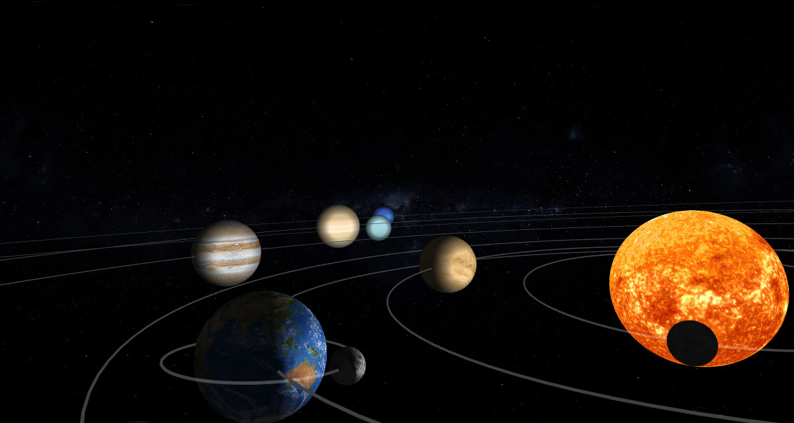

# Solar System

This is an animated solar system model implemented with OpenGL and FreeGLUT in C.

## Screenshot

## Features

- Texture.
- Lighting.
- Camera moving.
- Sun, eight planets and moon.
- Axis tilt and orbit inclination (Visualizing the formation of midnight sun).
- Astronomical data from Wikipedia.

## Usage

- Preset views:
    - `1`/`2`: Far / near top-down view.
    - `3`/`4`: Far / near perspective view.
    - `5`/`6`: Far / near view at ecliptic.
    - `7`/`8`: Far / near perspective view on x-axis.
- Viewport:
    - `W`/`S`: Forward / backward.
    - `A`/`D`: Left / right.
    - `Q`/`E`: Up / down.
    - Mouse wheel: Forward / backward.
    - Mouse dragging: Move scene around camera.
- Rotation:
    - `-`/(`+`/`=`): Time forward / backward.
    - `[`/`]`: Speed up / down. This also has an influence on current time.
- Debugging:
    - `P`: Print viewport vectors.

## Texture

Texture are taken from [solarsystemscope.com](http://www.solarsystemscope.com/nexus/textures/planet_textures/) which are licensed under [CC BY 3.0](https://creativecommons.org/licenses/by/3.0/), and exported in TGA format for use.

## Lighting

Lighting is implemented with `glLightfv()`, a point light source positioned at the center of sun. Since sun itself is a light-emitting object, its lighting is simply turned off.

## Camera moving

`gluLookAt()` is used for the viewing matrix, while the program keeps track of the eye position, look direction and up direction vectors. Keyboard and mouse input adjust these values accordingly.

## Data

Astronomical data are taken from the planet pages on [Wikipedia](https://en.wikipedia.org). In order to keep the size and offset of this model reasonable, values are scaled by functions to present a sensible rendering, while maintaining their relative magnitude.

You can get an impression of the actual scale of solar system at [If the Moon Were Only 1 Pixel](http://joshworth.com/dev/pixelspace/pixelspace_solarsystem.html).

Both physical and orbital data of every planet is kept as a `body_t`, with a null-terminated `body_t *` array field containing its children. They are initialized as globals at the beginning of the program.
